### C/S 架构 在线聊天室

Python基于Tkinter实现的C/S架构在线聊天室，包括聊天室以及私聊功能，支持文件共享，实现了用户注册、登录功能，并对距上次登录时间超出一定期限的用户进行提醒并冻结账号

#### 测试截图
##### 服务器running

##### 客户端登录
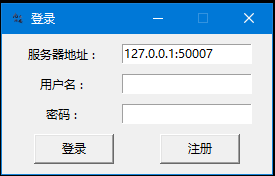

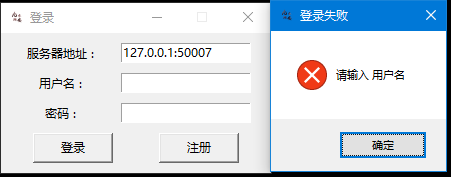

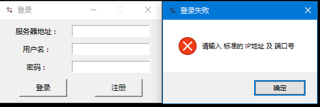

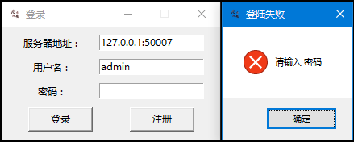

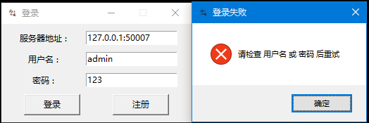

成功登录
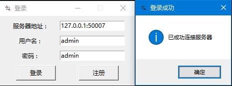

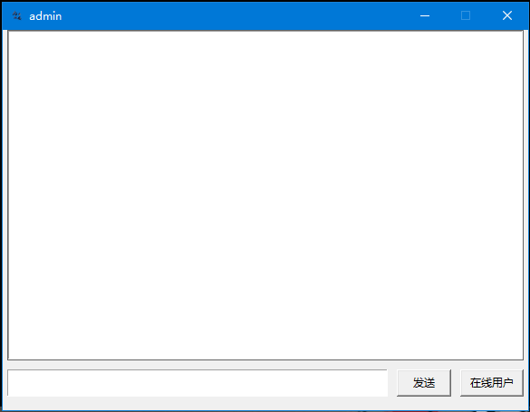

长期未登录，冻结账号
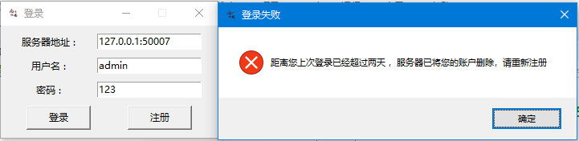

##### 注册
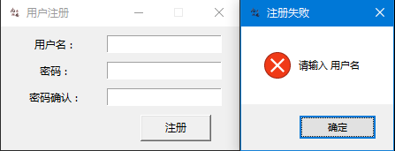

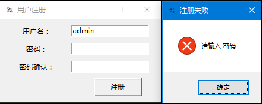

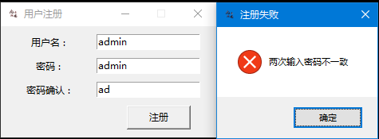

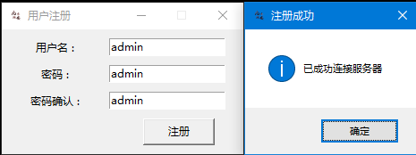

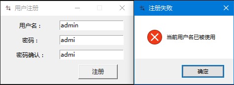

##### 聊天室聊天
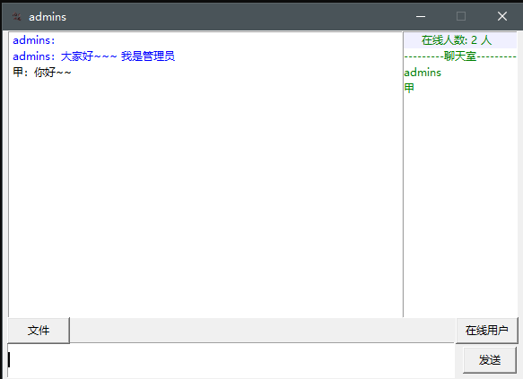
文件上传
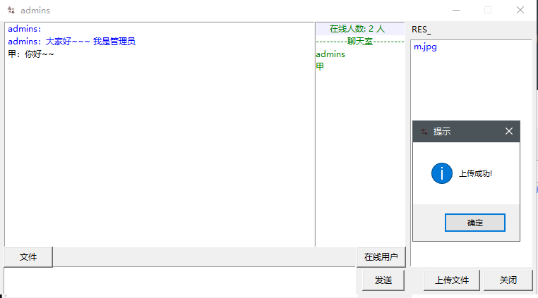
文件下载
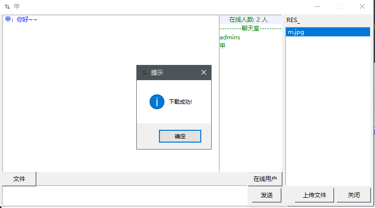
##### 私聊
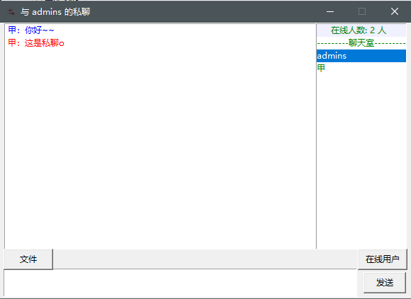
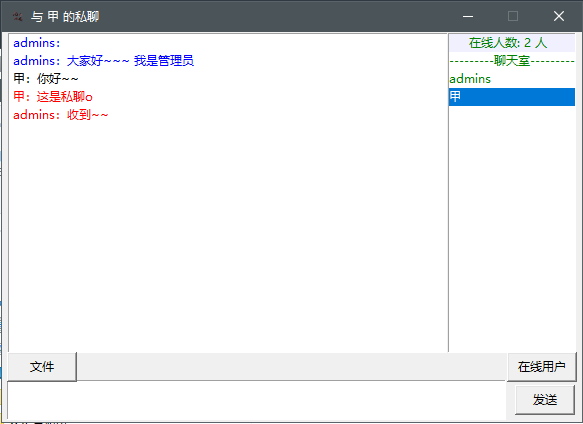
